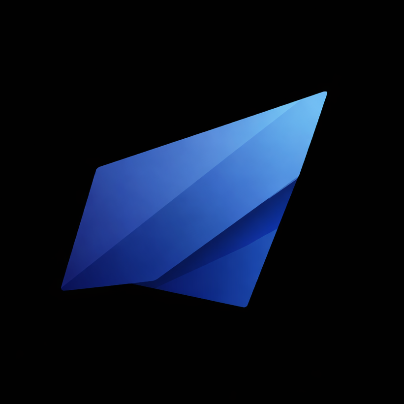

# Triad Studio Image Editor

[](https://react.dev/)
[](https://www.typescriptlang.org/)
[](https://vite.dev/)
[](https://sass-lang.com/)

Онлайн-фоторедактор для быстрой обработки изображений прямо в браузере: загрузка или вставка из буфера, обрезка, поворот, скругление углов и экспорт в несколько форматов.

**Live Demo:** https://4ertopolohh.github.io/image-editor-view/



## Содержание

- [Функциональность](#функциональность)
- [Технологии](#технологии)
- [Запуск локально](#запуск-локально)
- [Скрипты](#скрипты)
- [SEO](#seo)
- [Деплой](#деплой)
- [Структура проекта](#структура-проекта)
- [Ограничения и особенности](#ограничения-и-особенности)
- [Контакты](#контакты)

## Функциональность

- Загрузка изображения из файла (`PNG`, `JPG/JPEG`, `WebP`, `BMP`, `GIF`, `ICO`).
- Вставка изображения из буфера обмена (`Ctrl+V` / `Cmd+V`).
- Автоматическое удаление фона в браузере (без backend), с возможностью повторного запуска кнопкой.
- Обрезка с пресетами: `Free`, `1:1`, `16:9`, `4:3`, `3:4`, `9:16`.
- Поворот изображения на 90 градусов.
- Скругление каждого угла отдельно (0-50%).
- Экспорт в `PNG`, `JPG`, `WebP`, `ICO (256x256)`.
- Умное сжатие при экспорте: целевой размер файла + ограничение максимальной стороны.
- Валидация входных файлов по типу, размеру и разрешению.
- Интерфейс на двух языках (`RU/EN`) с сохранением выбора в `localStorage`.

## Технологии

- `React 19`
- `TypeScript`
- `Vite`
- `Sass (SCSS modules)`
- `react-image-crop`
- `@imgly/background-removal`
- `Canvas API` для обработки и экспорта изображений

## Запуск локально

### 1) Требования

- `Node.js` 20+
- `npm` 10+

### 2) Установка

```bash
npm install
```

### 3) Режим разработки

```bash
npm run dev
```

### 4) Production-сборка

```bash
npm run build
npm run preview
```

## Скрипты

- `npm run dev` - запуск dev-сервера Vite
- `npm run lint` - запуск ESLint
- `npm run build` - сборка приложения
- `npm run preview` - локальный просмотр production-сборки
- `npm run build:pages` - сборка с base path для GitHub Pages (`/image-editor-view/`)
- `npm run deploy` - публикация `dist/` в отдельный pages-репозиторий

## SEO

В проекте реализована базовая SEO-оптимизация на уровне кода:

- `title`, `meta description`, `canonical`
- `Open Graph` + `Twitter Cards`
- `robots` и `googlebot` meta directives
- `schema.org` (`WebApplication` + `WebSite`) через JSON-LD
- `robots.txt` и `sitemap.xml`
- корректная структура заголовков (`h1-h3`) и семантические HTML-секции
- мультиязычные SEO-метаданные (`ru/en`) с `og:locale` и `og:locale:alternate`

## Деплой

### GitHub Pages (текущая схема проекта)

```bash
npm run build:pages
npm run deploy
```

Скрипт `deploy` отправляет сборку в отдельный репозиторий:
`https://github.com/4ertopolohh/image-editor-view`

### Обычный деплой (без Pages)

Для стандартного хостинга достаточно:

```bash
npm run build
```

и публикации содержимого директории `dist/`.

## Структура проекта

```text
image-editor/
  public/
    favicon.ico
    og-image.png
    robots.txt
    sitemap.xml
  src/
    components/
    constants/
    hooks/
    styles/
    types/
    utils/
    App.tsx
    main.tsx
  index.html
  package.json
  vite.config.ts
```

## Ограничения и особенности

- Приложение работает как `CSR SPA` (без SSR).
- Обработка изображений выполняется в браузере пользователя через `Canvas API`.
- Для очень больших изображений действуют ограничения:
  - размер файла до `25 MB`
  - максимальная сторона до `8000 px`
  - лимит общего количества пикселей
- Для удаления фона при первом запуске дополнительно загружаются модель и runtime-файлы (кэшируются браузером).
- При первом запуске (если язык не сохранен) выполняется короткий IP geo lookup для выбора языка по умолчанию.

## Контакты

- Studio: **Nemida Studio**
- Telegram: https://t.me/NemidaStudio
